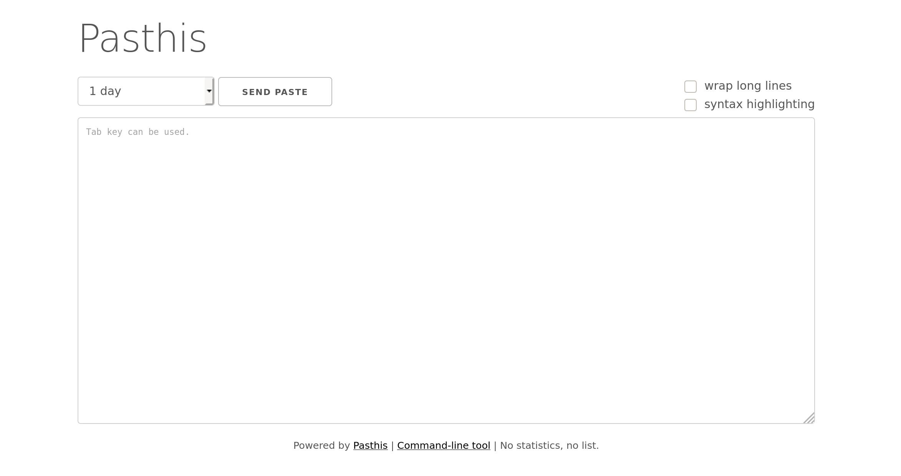

# _Pasthis_

_Pasthis_ is a pastebin written in [PHP](https://www.php.net) using
[SQLite](https://sqlite.org/) as database backend and
[prettify](https://code.google.com/p/google-code-prettify/) to handle the syntax
highlighting. This project is licensed under [GPLv2+](LICENSE).



## Privacy, security, simplicity

- Expired pastes are automatically deleted.
- Paste IDs aren't predictable (their URL cannot be guessed easily).
- No statistics, counter or public list of pastes is available.
- The use of HTTPS to post or get the pastes is enforced.
- A trivial anti-spam filter is built-in.
- By default the content is not formatted nor changed in any way (no wrap, no
  syntax highlighting). It is a user driven choice to do so.
- Pastes can be displayed as raw.
- A command-line tool can be downloaded to post pastes directly from terminals.
- Tabulations are handled within the textarea to avoid changing the focus.
- The design is mobile friendly (responsive) :blush:

## Deployment

1. Download _[Pasthis](https://github.com/moulecorp/pasthis)_.
2. Configure the web server:
   - Apache: edit the RewriteBase directive in the
     [.htaccess](https://github.com/moulecorp/pasthis/blob/master/resources/.htaccess)
     if needed.
   - Nginx: see the provided
     [nginx.conf](https://github.com/moulecorp/pasthis/blob/master/resources/nginx.conf).
   - Caddy: see the provided
     [Caddyfile](https://github.com/moulecorp/pasthis/blob/master/resources/Caddyfile).
3. Make sure that the folder is _readable_ and _writable_ by www-data, since
   this is required by PHP to be able to create the SQLite database.

It is required to call the cron method on a regular basis to delete expired
pastes, as a privacy concern. To do this on a GNU/Linux machine edit the
`/etc/crontab` file and add the following line:

```
*/10 * * * * www-data php /path/to/pasthis/index.php
```

Be aware expired pastes can only be deleted when requested or when the cron
method is called. Without the previous cron configuration, their deletion can't
be ensured. They just won't be displayed.

## Update

1. Update to the latest version (keep the database!).
2. Run `php update.php`.

## Command line tool

A [command line tool](https://github.com/moulecorp/pasthis/blob/master/pasthis.py)
is available allowing you to post files. In order to take advantage of this
utility, download it, make it executable and display the help output for more
information:

```
chmod +x ./pasthis.py
./pasthis.py --help
./pasthis.py --url https://www.example.net/pasthis/ file.txt
```

## Anti-spam

Every time a paste is sent, a value (called degree) is associated to
the poster's ip hash. It is used in the following formula:

```
T = time() + intval(pow(degree, 2.5))
```

If the user posts another paste after T, the degree is reset to zero.
If he tries before T, the degree is incremented, and the paste is denied.

There is also an hidden field, that set the degree to 512 (which corresponds
to ~72h) if filled.
